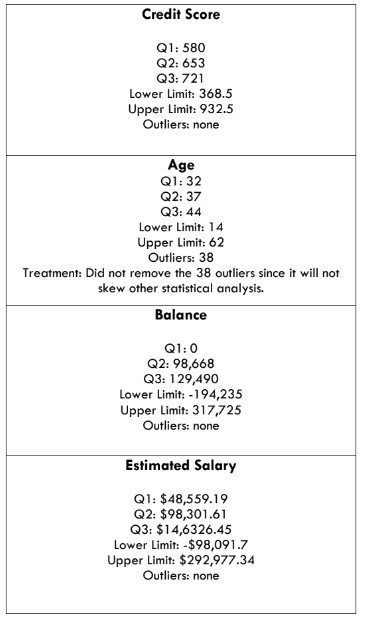
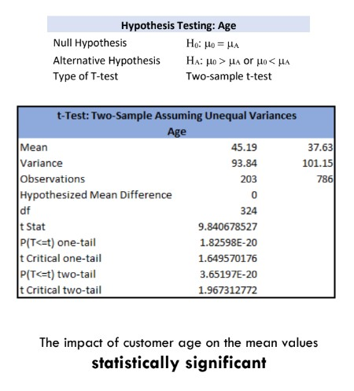
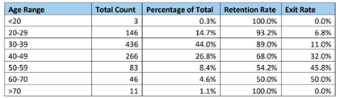
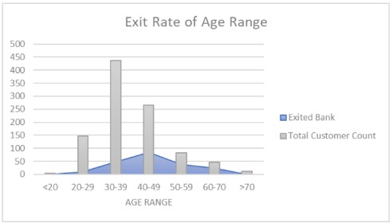
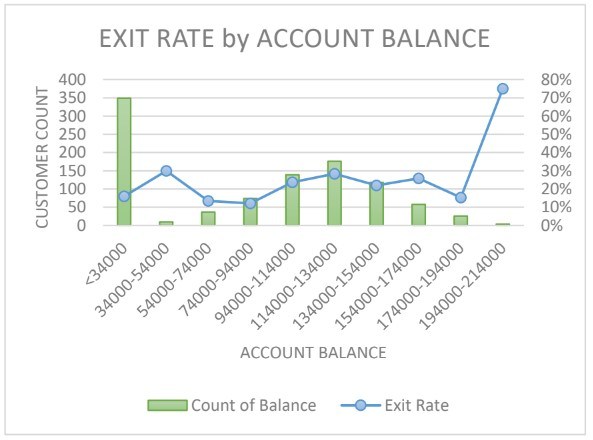
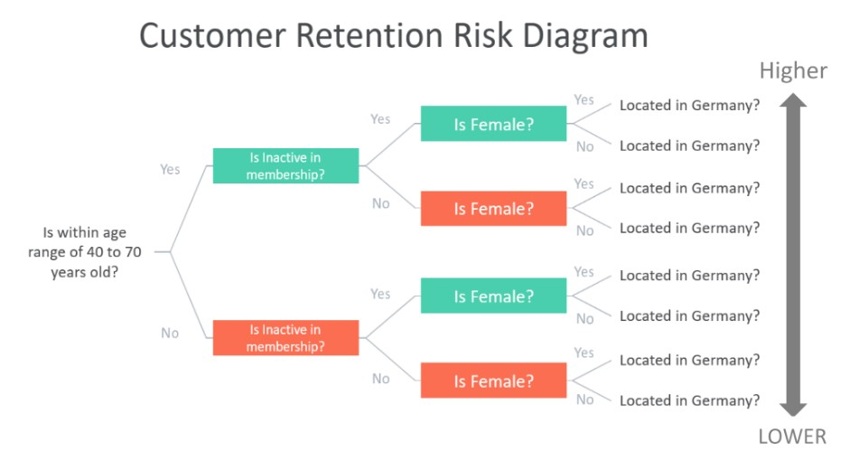
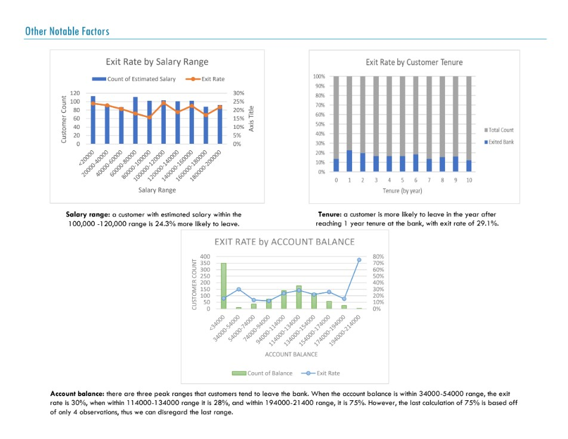
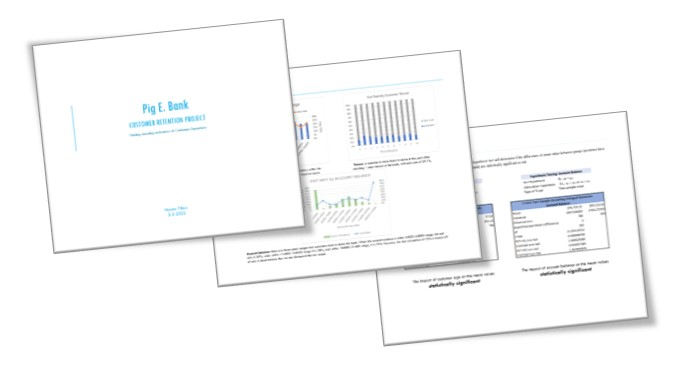

  <a href="https://tiltonneena.github.io/portfolio/">Back to Portfolio Homepage</a>

# P.E. Bank Customer Retention Project
### By Neena Tilton

  

### Background
A global financial services company is working to increase customer retention. The sales team is looking to identify the leading indicators that a customer will leave the bank. The goal of the analysis is to build a prototype model to predict the probability of customer departure based on profile attributes, such as age, estimated salary, gender, etc. The project will involve addressing personally identifiable information, data privacy, and data security. 

### Tools & Context
- **Microsoft Excel:** predictive analysis, forecasting, time-series analysis, hypothesis testing, and data visualization. 

### Data Source
The P.E. Bank client [data](https://github.com/tiltonneena/PE-Bank-Project/blob/main/Dataset/PEBank_dataset.xlsx) used for this project is a fictionalized data set provided by CareerFoundry. The data set had 991 rows with 11 columns. 

### Methodology

1.	The analysis began with a thorough assessment of data quality by tackling missing and duplicate data. Also, data privacy was a central focus in this project since the data set contained client last names, age, gender, salary information, and other personally identifiable information. To protect customer privacy, the whole column containing customer last names was removed. Data accuracy checks were also performed by running an outlier check, an extreme values check, and  a descriptive statistics check.  

    

      
    

    

      <em>Section of the report showing the outlier assessment.</em>
    

    
2.	Once the data quality was confirmed, hypothesis testing was performed for each profile factor. 

    

      
    

    

      <em>The hypothesis testing found age to be a statistically significant factor when considering customer departure. </em>
    

    
3.	Retention rate based on customer characteristics was also calculated.     

    

      
    

    

      <em>Each age range had a varying exit rate percentage.</em>
    

    
4.	Data visualizations were drafted to make the findings more digestible. 

    

      
    

    

      <em>Combination chart of total customers (bars) for each age-range overlayed on top of the exit rate (blue area) for each group.</em>
    

    

      
    

    

      <em>Combination chart of total customers (bars) within each salary-range along with the exit rate (blue line) of each group. </em>
    

    

5.	A prototype model of a decision tree was created, which assessed the probability of a customer leaving the bank.

    

      
    

    
6.	All analyses and findings were consolidated into one report for the manager of the sales team to review. 
    

      
    

    

      <em>A page taken from the 16-page report, documenting each step taken for the complete analysis.</em>
    

    
### Key Findings
- Age was the number one leading factor that impacted customer retention. A customer between the ages of 40 and 70 years was 42.6% more likely to leave the bank.
- Membership was the second leading factor that impacted retention. An inactive member was 29.3% more likely to leave than an active member.
- Gender was the third leading factor that impacted customer retention. Of the total customer base who were female, 26.1% left the bank.

### Deliverable

[Full Report Document](https://drive.google.com/file/d/13jXS39TpEYZFVgbemn-oLIMgKqJ3uhxD/view)

  

  <a href="https://tiltonneena.github.io/portfolio/">Back to Portfolio Homepage</a>

